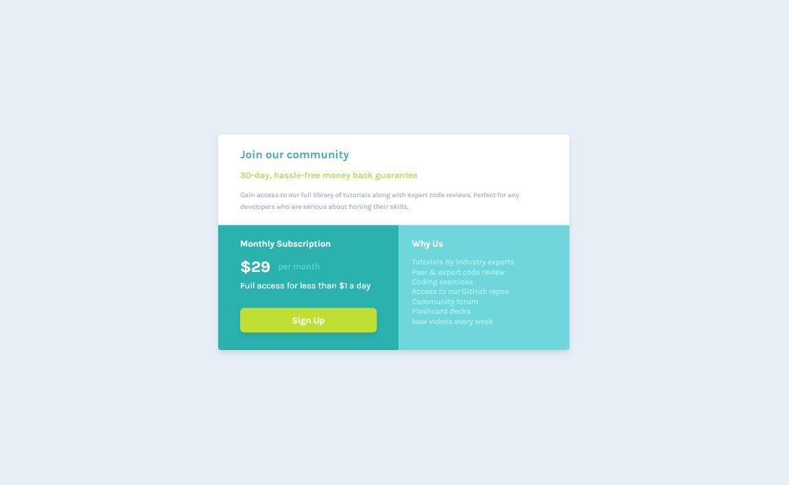

# Frontend Mentor - Single price grid component solution

This is a solution to the [Single price grid component challenge on Frontend Mentor](https://www.frontendmentor.io/challenges/single-price-grid-component-5ce41129d0ff452fec5abbbc). Frontend Mentor challenges help you improve your coding skills by building realistic projects. 

## Table of contents

- [Overview](#overview)
  - [The challenge](#the-challenge)
  - [Screenshot](#screenshot)
  - [Links](#links)
- [My process](#my-process)
  - [Built with](#built-with)
  - [What I learned](#what-i-learned)
  - [Continued development](#continued-development)

## Overview

### The challenge

Users should be able to:

- View the optimal layout for the component depending on their device's screen size
- See a hover state on desktop for the Sign Up call-to-action

### Screenshot

### Links

- Solution URL: [https://github.com/FrontendMentor-Lecap/Single-Price-Grid-Component]
- Live Site URL: [https://frontendmentor-lecap.github.io/Single-Price-Grid-Component/]

## My process

### Built with

- Semantic HTML5 markup
- CSS custom properties
- Flexbox
- Mobile-first workflow

### What I learned

I learned about positioning strategies to prevent using media queries as much as possible. It can be sometimes difficult to create a product that can scale with the shortest amount of code. I learned about coloring with variables and different shortcuts VSCODE gives you to select colors faster.  

Initially I thought that the "Why Us" division had a paragraph inside, but then I saw it was an unordered list with 7 li's.

I also learned about different techniques to create shades, and I hope I used the appopriate ones for the main component and the "Sign Up" link.

### Continued development

I still want to continue improving with Rem's and EM's , specially while assigning margin and padding values. I also want to continue improving my coding speed, I think I take a long time to do a simple thing. Knowledge and experience are big part of the latter.